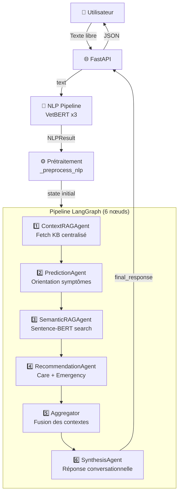

# 🏥 DoctoAgent — Documentation Détaillée des Agents

> [!NOTE]
> Cette documentation couvre l'architecture complète du système multi-agents DoctoAgent,
> incluant le pipeline NLP, les 6 agents LLM, l'orchestrateur LangGraph, et tous les outils.

---

## 📐 Architecture Globale



---

## 1. 🧠 Pipeline NLP — [pipeline.py](file:///c:/Users/nesrin/Desktop/module_docto_agent/backend/nlp/pipeline.py)

Le pipeline NLP est le **point d'entrée** de toute requête. Il transforme le texte brut en données structurées **avant** les agents LLM.

### Modèles chargés

| Modèle | Tâche | Source | Détails |
|--------|-------|--------|---------|
| **VetBERT Intent** | Classification d'intention | `models_v2/intent_model` | 4 classes : `describe_symptom`, `ask_advice`, `emergency`, `follow_up` |
| **VetBERT Urgency** | Classification d'urgence | `models_v2/urgency_model` | 4 niveaux : `LOW`, `MODERATE`, `HIGH`, `CRITICAL` |
| **VetBERT NER** | Extraction d'entités | `models_v2/ner_model_vetbert` | Labels BIO : `SYMPTOM`, `ANIMAL`, `DURATION` |

### Méthode `process(text)` — Étapes

```
Texte brut
  │
  ├─ 1. Détection de langue (heuristique FR/EN/AR)
  ├─ 2. Tokenisation (split sur espaces)
  ├─ 3. Intent Classification (VetBERT) → intent + confidence
  ├─ 4. Urgency Classification (VetBERT) → label + score (1-10)
  ├─ 5. Override sécurité (mots-clés critiques → force HIGH/CRITICAL)
  ├─ 6. Override MODERATE (symptômes persistants → force LOW→MODERATE)
  ├─ 7. Anti-overcorrection (patterns bénins → CRITICAL→HIGH)
  └─ 8. NER (VetBERT) → entités [SYMPTOM, ANIMAL, DURATION]
           │
           ▼
       NLPResult (Pydantic)
```

### Sortie `NLPResult`

```python
class NLPResult(BaseModel):
    original_text      : str          # "My dog has been vomiting"
    language           : str          # "en" | "fr" | "ar"
    tokens             : List[str]    # ["My", "dog", "has", ...]
    intent             : str          # "describe_symptom"
    intent_confidence  : float        # 0.87
    urgency_score      : int          # 1-10
    urgency_label      : str          # "MODERATE"
    urgency_confidence : float        # 0.72
    entities           : List[Dict]   # [{"text":"dog","label":"ANIMAL"}, ...]
    ner_source         : str          # "vetbert"
```

### Mécanismes de sécurité

- **Override critique** : si le texte contient `"bleeding"`, `"convulse"`, `"poison"`, etc. → force `HIGH` minimum
- **Override MODERATE** : si `"since yesterday"`, `"depuis 2 jours"` → force `LOW` → `MODERATE`
- **Anti-overcorrection** : si `"scratching"`, `"limping occasionally"` → ramène `CRITICAL` → `HIGH`

---

## 2. ⚙️ Prétraitement `_preprocess_nlp()` — [orchestrator.py:103-148](file:///c:/Users/nesrin/Desktop/module_docto_agent/backend/agents/orchestrator.py#L103-L148)

> [!IMPORTANT]
> Ce module **remplace** les anciens `SymptomAgent` et `UrgencyAgent`. Aucun appel LLM — traitement purement déterministe.

### Ce qu'il fait

1. **Normalise les symptômes** via `_SYMPTOM_KB_MAP` (92 entrées FR/EN → clé KB)
2. **Extrait** l'animal, la durée depuis les entités NER
3. **Construit** `_symptom_context` et `_urgency_context`

### Sortie

```python
_symptom_context = {
    "animal"              : "dog",
    "symptoms_normalized" : ["vomissement", "diarrhée"],
    "duration"            : "depuis 2 jours",
    "symptom_count"       : 2,
    "confidence"          : 0.85,
}

_urgency_context = {
    "nlp_level"     : "MODERATE",
    "refined_level" : "MODERATE",
    "refined_score" : 4,
    "label"         : "Consultation conseillée sous 48h",
    "confidence"    : 0.72,
}
```

---

## 3. 🔧 Base LLM Agent — [base_llm_agent.py](file:///c:/Users/nesrin/Desktop/module_docto_agent/backend/agents/base_llm_agent.py)

Classe abstraite dont **tous les agents LLM héritent**. Implémente la boucle **ReAct** (Reasoning + Acting).

### Configuration

| Paramètre | Valeur | Description |
|-----------|--------|-------------|
| `GEMINI_MODEL` | `gemini-2.0-flash-lite` | Modèle Gemini par défaut |
| `GROQ_MODEL` | `llama-3.3-70b-versatile` | Modèle Groq alternatif |
| `MAX_ITERATIONS` | 2 | 1 tour outils + 1 tour réponse |
| `REQUEST_TIMEOUT` | 30s | Timeout par appel LLM |
| `MAX_RETRIES` | 3 | Retries sur erreur 429/503 |
| `LLM_PROVIDER` | `.env → LLM_PROVIDER` | `"gemini"` ou `"groq"` |

### Boucle ReAct

```
SystemMessage (system_prompt)
  +
HumanMessage (_build_prompt)
  │
  ▼
┌─────────────────────────────┐
│   Gemini/Groq répond        │
│                             │
│   ┌── Tool calls ? ───┐    │
│   │ OUI               │NON │
│   ▼                   ▼    │
│ Exécuter les      Réponse  │
│ outils            finale   │
│   │                   │    │
│   ▼                   ▼    │
│ ToolMessage(s)    _parse_  │
│   │               output() │
│   └── reboucle ──┘         │
└─────────────────────────────┘
```

### Méthodes à surcharger par chaque agent

| Méthode | Rôle |
|---------|------|
| `_build_prompt(context)` | Construit le message utilisateur depuis l'état |
| `_parse_output(raw, context)` | Parse le JSON de la réponse Gemini |
| `_fallback(context, error)` | Résultat de secours si le LLM échoue |

### Gestion d'erreurs

- **429 Rate Limit** : retry avec backoff (parse `retry_after` du header)
- **503 Unavailable** : retry après 8s
- **Quota épuisé** (`limit: 0`) : fallback immédiat, pas de retry
- **Tool call rejeté** : fallback immédiat

---

## 4. 📚 ContextRAGAgent (Nœud 1) — [rag_agent.py:375-411](file:///c:/Users/nesrin/Desktop/module_docto_agent/backend/agents/rag_agent.py#L375-L411)

### Rôle
**Agentic RAG** : le LLM décide quels outils KB appeler pour récupérer toutes les données pertinentes en une seule passe. Les agents suivants n'ont plus besoin d'interroger la KB.

### Outils disponibles (10 outils KB)

| Outil | Description |
|-------|-------------|
| `get_possible_causes(symptom)` | Causes fréquemment associées |
| `get_symptom_info(symptom)` | Infos complètes du symptôme |
| `get_red_flags(symptom)` | Signes d'alarme |
| `get_home_care(symptom)` | Conseils à domicile |
| `get_evolution_timeline(symptom)` | Évolution temporelle |
| `get_species_vulnerabilities(species)` | Vulnérabilités de l'espèce |
| `get_first_aid_steps(type)` | Premiers secours (urgences) |
| `get_toxic_foods(species)` | Aliments toxiques |
| `get_vaccination_schedule(species)` | Calendrier vaccinal |
| `get_breed_specific_risks(breed)` | Risques par race |

### Sortie (`_kb_context`)

```json
{
  "symptoms_data": {
    "vomissement": {
      "causes": ["gastrite", "corps étranger", ...],
      "red_flags": ["sang dans le vomi", ...],
      "home_care": ["diète 12h", ...],
      "timeline": {"24h": "...", "48h": "..."}
    }
  },
  "species_info": { "vulnerabilities": [...] },
  "first_aid": {},
  "breed_risks": {}
}
```

---

## 5. 🔮 PredictionAgent (Nœud 2) — [prediction_agent.py](file:///c:/Users/nesrin/Desktop/module_docto_agent/backend/agents/prediction_agent.py)

### Rôle
Agent d'**orientation** : identifie les conditions fréquemment associées aux symptômes. **Ne pose PAS de diagnostic.**

### Outils

| Outil | Quand |
|-------|-------|
| `web_search_vet(query)` | Si symptôme absent du KB_CONTEXT |
| `search_wikipedia_vet(topic)` | Complément encyclopédique |

### Prompt structuré

Le prompt injecte : texte original, animal, symptômes normalisés, durée, urgence, red flags, et tout le `KB_CONTEXT` pré-chargé.

### Sortie

```json
{
  "possible_associations": [
    {
      "condition": "gastrite aiguë",
      "frequency": "HIGH",
      "source_symptoms": ["vomissement"],
      "requires_vet": true,
      "urgency_hint": "MODERATE",
      "watch_for": "sang dans le vomi"
    }
  ],
  "main_concern": "gastrite aiguë",
  "watch_delay": "24-48h",
  "kb_coverage": 0.8,
  "vet_consultation_needed": true,
  "confidence": 0.75,
  "orientation_summary": "Ces symptômes sont fréquemment associés à..."
}
```

### Fallback KB
Si le LLM échoue, le fallback utilise `_kb_associations()` pour construire les associations directement depuis la KB sans appel LLM.

---

## 6. 🔍 SemanticRAGAgent (Nœud 3) — [rag_agent.py:103-316](file:///c:/Users/nesrin/Desktop/module_docto_agent/backend/agents/rag_agent.py#L103-L316)

### Rôle
Recherche sémantique dans `vet_advice_kb.json` via **Sentence-BERT** (pas de LLM).

### Modèle

| Propriété | Valeur |
|-----------|--------|
| Modèle | `paraphrase-multilingual-MiniLM-L12-v2` |
| Langues | 50+ (FR, EN, AR inclus) |
| Taille | ~470 MB |
| Seuil match | `0.45` (cosine similarity) |

### Processus

```
1. Charger KB (scenarios JSON)
2. Encoder tous les scénarios → vecteurs (au démarrage)
3. À chaque requête :
   a. Construire query enrichie (texte + entités + espèce)
   b. Encoder la query → vecteur
   c. Cosine similarity avec tous les scénarios
   d. Filtrer par espèce si disponible
   e. Vérifier exclusions
   f. Retourner le meilleur match ou fallback
```

### Sortie `AdviceResult`

```python
AdviceResult(
    scenario_id     = "dog_vomiting_01",
    title           = "Vomissements chez le chien",
    advice          = "Si votre chien vomit...",
    home_care       = ["Diète 12h", "Eau en petites quantités"],
    watch_for       = ["Sang dans le vomi", "Léthargie"],
    when_to_consult = "Si vomissements > 24h",
    urgency         = "MODERATE",
    confidence      = 0.72,
    is_emergency    = False,
    match_quality   = "high",  # "high" | "low" | "none"
)
```

---

## 7. 💊 RecommendationAgent (Nœud 4) — [recommendation_agent.py](file:///c:/Users/nesrin/Desktop/module_docto_agent/backend/agents/recommendation_agent.py)

### Rôle
Agent **unifié** qui remplace 3 anciens agents : `CareAgent` + `EmergencyAgent` + ancien `RecommendationAgent`.

### Comportement adaptatif

| Urgence | Comportement |
|---------|-------------|
| **LOW / MODERATE** | ⛔ Aucun outil. Utilise uniquement KB_CONTEXT |
| **HIGH** | ✅ Appelle `find_partner_vets(emergency_only=False)` |
| **CRITICAL** | ✅ Appelle `find_partner_vets(emergency_only=True)` + `get_first_aid_steps()` |

### Outils (HIGH/CRITICAL uniquement)

| Outil | Description |
|-------|-------------|
| `find_partner_vets(emergency_only)` | 6 cliniques vétérinaires partenaires en Tunisie |
| `get_first_aid_steps(type)` | 8 types : intoxication, convulsion, coup de chaleur, hémorragie, étouffement, choc, fracture, noyade |
| `get_toxic_foods(species)` | 6 espèces : dog, cat, rabbit, bird, hamster, guinea_pig |
| `web_search_vet(query)` | Recherche DuckDuckGo vétérinaire |

### Sortie complète

Le JSON de sortie contient : `is_emergency`, `urgency_level`, `alert_message`, `immediate_actions`, `partner_vets`, `care_plan` (avec `home_care_steps`, `monitoring_signs`, `when_to_consult`, `diet_advice`, `timeline`), `message`, `actions`, `warnings`, `safety_warning`.

### Fallback KB
Construit un plan de soin complet à partir de la KB locale avec des templates par niveau d'urgence, sans appel LLM.

---

## 8. 🔗 Aggregator (Nœud 5) — [aggregator.py](file:///c:/Users/nesrin/Desktop/module_docto_agent/backend/agents/aggregator.py)

### Rôle
**Pas un agent LLM** — module déterministe qui fusionne toutes les sorties en une réponse API structurée.

### Responsabilités

1. Assembler les dicts de chaque agent en JSON unifié
2. Résoudre les conflits d'urgence (niveau le plus sévère gagne)
3. Construire le `main_message` (priorité : emergency > recommendation > fallback)
4. Injecter le disclaimer de sécurité obligatoire
5. Calculer les métadonnées (temps, agents utilisés, version `2.0.0`)

### Structure de la réponse finale

```json
{
  "status": "success",
  "main_message": "...",
  "analysis": { "original_text", "language", "intent", "entities" },
  "urgency": { "level", "score", "red_flags_found", "reasoning" },
  "symptoms": { "animal", "symptoms_normalized", "duration" },
  "predictions": { "possible_associations", "main_concern", "watch_delay" },
  "emergency": { "is_emergency", "partner_vets", "immediate_actions" },
  "care_plan": { "home_care_steps", "monitoring_signs", "diet_advice" },
  "rag_advice": { "title", "advice", "confidence", "match_quality" },
  "recommendation": { "message", "actions", "warnings" },
  "safety_disclaimer": "⚕️ DoctoAgent est un outil d'aide...",
  "metadata": { "pipeline_version", "agents_used", "agent_timings_ms" }
}
```

---

## 9. 💬 SynthesisAgent (Nœud 6) — [synthesis_agent.py](file:///c:/Users/nesrin/Desktop/module_docto_agent/backend/agents/synthesis_agent.py)

### Rôle
Agent **final** : transforme la réponse agrégée technique en un **texte conversationnel** empathique et naturel, dans la langue de l'utilisateur.

### Caractéristiques

- **Pas d'outils** — synthèse pure par LLM
- **Multilingue** : répond en FR / EN / AR selon `language`
- **Adapte le ton** selon l'urgence :
  - CRITICAL/HIGH → direct, urgent
  - MODERATE → attentif, étapes concrètes
  - LOW → rassurant, informatif

### Prompt

Reçoit l'intégralité de la réponse agrégée : urgence, symptômes, prédictions, care_plan, emergency, RAG, recommendation — et génère un texte Markdown conversationnel.

### Sortie

```json
{
  "response_text": "**Bonjour !** Je comprends votre inquiétude...\n\n• Surveillez...\n• Si vous observez...\n\n_N'hésitez pas à consulter..._",
  "urgency_summary": "Surveillance recommandée — consultation sous 24-48h"
}
```

---

## 10. ✅ ValidationAgent — [validation_agent.py](file:///c:/Users/nesrin/Desktop/module_docto_agent/backend/agents/validation_agent.py)

> [!NOTE]
> Cet agent est défini mais **n'est pas dans le graphe LangGraph actuel**. Il est disponible comme extension.

### Rôle
Auditeur qualité du pipeline. Vérifie la cohérence avant envoi à l'utilisateur.

### 5 contrôles

| Check | Description |
|-------|-------------|
| CHECK-1 | Qualité des entités (symptômes/animal détectés ?) |
| CHECK-2 | Cohérence urgence (niveau justifié par les symptômes ?) |
| CHECK-3 | Pertinence des pistes (conditions cohérentes ?) |
| CHECK-4 | Intégrité du texte (assez long et clair ?) |
| CHECK-5 | Sécurité du conseil (oriente vers vétérinaire si nécessaire ?) |

---

## 11. 🛠️ Outils (`tools.py`) — [tools.py](file:///c:/Users/nesrin/Desktop/module_docto_agent/backend/agents/tools.py)

### Catégories d'outils

| Catégorie | Outils | Utilisé par |
|-----------|--------|-------------|
| **KB Internes** | `list_kb_symptoms`, `get_symptom_info`, `get_possible_causes`, `get_red_flags`, `get_home_care`, `get_evolution_timeline` | ContextRAGAgent, ValidationAgent |
| **Espèces** | `get_species_vulnerabilities`, `get_vaccination_schedule`, `get_breed_specific_risks`, `get_toxic_foods` | ContextRAGAgent, RecommendationAgent |
| **Urgences** | `get_first_aid_steps`, `find_partner_vets` | RecommendationAgent |
| **Externes** | `web_search_vet` (DuckDuckGo), `search_wikipedia_vet` | PredictionAgent |

### Données intégrées dans les outils

- **6 cliniques vétérinaires** partenaires en Tunisie (Tunis, Sfax, Sousse)
- **8 protocoles de premiers secours** détaillés
- **6 listes d'aliments toxiques** par espèce
- **8 profils de vulnérabilités** par espèce
- **4 calendriers vaccinaux**
- **Risques spécifiques** par race (labrador, berger allemand, golden, bulldog, etc.)

---

## 12. 🔄 Orchestrateur LangGraph — [orchestrator.py](file:///c:/Users/nesrin/Desktop/module_docto_agent/backend/agents/orchestrator.py)

### Flux du graphe

```
START → context_rag_node → prediction_node → rag_node → recommendation_node → aggregate_node → synthesis_node → END
```

### État partagé `DoctoAgentState`

```python
class DoctoAgentState(TypedDict):
    nlp_dict               : Dict  # Données NLP + contextes injectés
    symptom_context        : Dict  # Symptômes normalisés
    urgency_context        : Dict  # Urgence raffinée
    kb_context             : Dict  # Données KB centralisées
    prediction_context     : Dict  # Associations de conditions
    rag_context            : Dict  # Résultat Sentence-BERT
    recommendation_context : Dict  # Care + Emergency + Recommendation
    synthesis_context      : Dict  # Texte conversationnel final
    final_response         : Dict  # Réponse agrégée complète
    agent_timings          : Dict  # Temps de traitement par agent
    is_emergency           : bool  # Flag urgence
```

### Singleton — [shared.py](file:///c:/Users/nesrin/Desktop/module_docto_agent/backend/agents/shared.py)

L'orchestrateur est instancié **une seule fois** et partagé entre toutes les routes FastAPI via le module `shared.py`. Le `SemanticRAGAgent` (~470 MB de modèle) n'est chargé qu'une fois.

---

## 📊 Résumé des Agents

| # | Agent | Type | LLM ? | Outils | Rôle |
|---|-------|------|-------|--------|------|
| 0 | `_preprocess_nlp` | Fonction | ❌ | 0 | Normalisation symptômes + urgence |
| 1 | `ContextRAGAgent` | LLM Agent | ✅ | 10 | Fetch KB centralisé |
| 2 | `PredictionAgent` | LLM Agent | ✅ | 2 | Orientation symptômes |
| 3 | `SemanticRAGAgent` | Sentence-BERT | ❌ | 0 | Recherche sémantique KB |
| 4 | `RecommendationAgent` | LLM Agent | ✅ | 4 | Care + Emergency unifié |
| 5 | `Aggregator` | Déterministe | ❌ | 0 | Fusion des contextes |
| 6 | `SynthesisAgent` | LLM Agent | ✅ | 0 | Réponse conversationnelle |
| — | `ValidationAgent` | LLM Agent | ✅ | 3 | Audit qualité (extension) |
